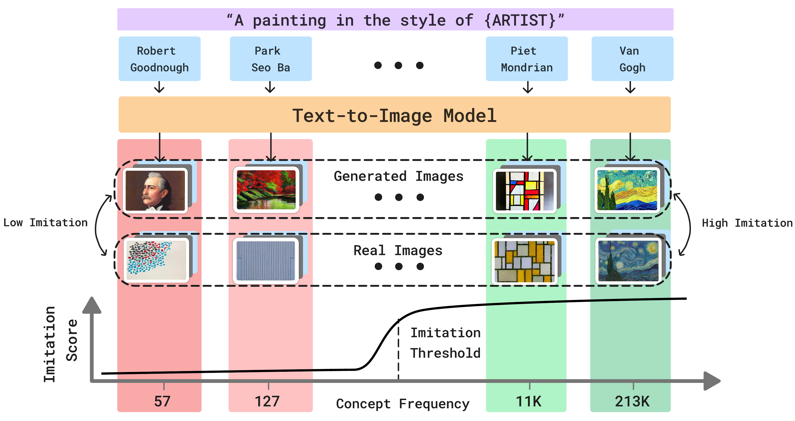

<div style="text-align: center;">
  <h1 style="font-size: 3em;">MIMETIC<sup>2</sup></h1>
  
</div>

## HUMAN FACE IMITATION

### Installing Conda Enviroment

```bash
conda env create -f mimetic2.yml
```

This will install the conda enviroment named `mimetic2-env`, which can be activated using:

```bash
conda activate mimetic2-env
```

### Generating Images Using the Diffusion Model

We use two files to generate images, one file actually generates the images by calling the StableDiffusion model (`gen_images.py`), the other file parallelizes the process of calling this file across GPUs (`run_gen_images.py`). Please change the cache dir at the top of both these files. 

To generate images for a bunch of people, place their names in a list and put that list in the __main__ function of `run_gen_images.py`, and run 

```bash
python run_gen_images.py --produce_images --prompt_id 0 --fixed_gpus --set_of_people celebrity --model_id 1 --chunk_number 999 --max_gpus 1
```

This will internally call `python gen_images.py --total_images 200 --batch_size 20 --prompt_id {args.prompt_id} `. Please provide the number of GPUs to use as `--max_gpus`. The code parallelizes the process of generation of images across the GPUs. The code has default values for common GPU types, but adjust it depending on the GPU you have. 

The generated images will be saved in directory `generated_images_{set_of_people}_{model_id}`, where each celebrity will get its own subdirectory, and within that subdirectory, the specific prompt will have its own subdirectory which will have the images. We also generate a grid of the images if the total number of images are in a few prescribed sizes (see ` generate_batched_images` in `gen_images.py`). 

### Training Images for Comparison
There are three main steps for collecting the training images for a person. The first step is to collect their training images from the pretraining corpus of the diffusion model. The second step is to collect the gold standard images for each person, and the third step is to use these gold standard images to filter out the training images collected in the first step.

#### Collecting Training Images from the Pretraining Corpus
1. The first step is to download images of the people we have generated the images for and want to compare against. For downloading images, use 
```bash
python extract_from_laion_database.py --set_of_people celebrity --download_images --parallelize_download_across_images_of_one_entity
```
This command will download the images corresponding to the captions that contain the celebrity's name. There are two flags to speed up the download process: `parallelize_download_across_images_of_one_entity` and `parallelize_download_across_images_of_one_entity`. The first flag parallelizes the download process across the CPUs for images of one person and the second flag parallelizes across images of different people. 

2. The next step if to add extension to the images which do not have images from the download. This code will also delete some of the images that cannot be opened or are corrupted or are too small. 
```bash
python get_laion_caption.py --remove_and_rename_images --set_of_people celebrity --parallelize_across_one_entity
```

3. For the celebrities that have no training images, we will download images from the internet. We used SerpAPI for this task:
    1. Create an account on [SerpAPI](https://serpapi.com/google-images-api)
    2. Place the name of the celebrities for which the images have to downloaded in the file `high_quality_images_downloaded_from_internet/download_images_serpapi.py`
    2. This will perform search for each person in the list and create a json file that has ~100 links to images
```bash
cd high_quality_images_downloaded_from_internet
python download_images_serpapi.py --create_json_file
```
    3. After creating the json file, we then do the actual download of the images, for which use this:
```bash
python download_images_serpapi.py --download_images
```

#### Collecting Gold Standard Images

For getting the gold standard images of a person, we use the same procedure as used to collect images from the internet in the last step (using SerpAPI). From the downloaded images, we manually select the images that are single person and are of the person that we intend to measure imitation for. 

#### Filtering Training Images using Gold Standard Images

We filter the training images by embedding the training images using a face embedder and measuring the similarity between those faces and the gold standard faces. If the similarity is higher than the threshold established in the paper, we consider that image to belong to that person. 

1. Generate embeddings for the images from pretraining corpus: 
```bash
cd facial_detection_and_recognition
python facial_detection.py --generate_face_embeddings_parallel --all_laion_images --face_recognition_model insightface_resnet100 --set_of_people politicians --parallelize_across_entities
```
Change the path of the downloaded images in the function `face_recognition_to_compare_training_and_generated_images` to generate face embeddings. The embeddings will be stored in the directory: `insightface_resnet100_embeddings_close_up_{model_id}/all_laion_images`. We give more instruction at the end of the human face imitation section on setting up the face embedding tool with GPU. 

2. Generate embedding for the gold standard images from the internet:
```bash
python facial_detection.py --generate_face_embeddings_parallel --all_internet_images --face_recognition_model insightface_resnet100 --set_of_people celebrity --parallelize_across_entities
```
Change the path of the gold standard images in the function `face_recognition_to_compare_training_and_generated_images` to generate face embeddings. The embeddings will be stored in the directory: `insightface_resnet100_embeddings_close_up_{model_id}/all_images_internet`. 

3. To use the gold standard images to filter the training images:
```bash
python facial_detection.py --compute_similarity_selected_images --set_of_people 'celebrity' --face_recognition_model 'insightface_resnet100' --all_laion_images --same_face_threshold "lower"
```
Running this command will create a file: `insightface_resnet100_embeddings_close_up_1/num_face_counts_all_laion_images_celebrity_threshold_{face_threshold}.csv` which contains the number of images in the pretraining corpus of each celebrity. 

### Generating Face Embeddings of Generated Images

For generating the embeddings of the generated images, run:
```bash
python facial_detection.py --generate_face_embeddings_parallel --generated --image_generation_prompt_id 0 --face_recognition_model insightface_resnet100 --set_of_people celebrity --parallelize_across_entities --stable_diffusion_model 1
```
This command will generate the face embeddings of all the generated images that have one face and save them in the directory: `insightface_resnet100_embeddings_close_up_{model_id}/{the prompt corresponding to prompt id}`


### Computing Similarity between the Embeddings of the Training and Generated Images

1. We find the similarity between the generated images and the closest 10 training images using:
```bash
python facial_detection.py --face_recognition_to_compare_training_and_generated_images --match_embeddings_face_recognition --training --image_generation_prompt_id 0 --face_recognition_model insightface_resnet100 --set_of_people celebrity --use_filtered_laion_images_and_selected_images_for_matching --same_face_threshold "lower" --stable_diffusion_model 1
```

2. This will print the average cosine similarity for all celebrities in the file: `average_cosine_similarity_closeup_training_and_single_face_generated_images_prompt_{image_generation_prompt}_top_filtered_laion_images_and_selected_images_training_images_using_insightface_resnet100_celebrity_{face_threshold}.csv`. 

3. For plotting the similarity scores, use the following command:
```bash
python facial_detection.py --plot_similarity_training_and_generated_images --select_training_images_based_on_similarity_to_generated_images_on_average --image_generation_prompt_id 0 --face_recognition_model insightface_resnet100 --set_of_people celebrity --use_filtered_laion_images_and_selected_images_for_matching --same_face_threshold "lower" --stable_diffusion_model 1 
```
This will create the similarity plot in the directory `similarity_plots_SD1.1` named `SD1.1_separate_plot_average_cosine_similarity_using_insightface_resnet100_filtered_laion_images_and_selected_images_training_images_celebrity_threshold_{face_threshold}.png`. 


### Setting up the Face Embedding Model with GPU

We will use `insightface_resnet100` for face recognition task, therefore we will generate embeddings from this model. For this task, first we need to make insightface run on GPUs, for which, execute the following steps:
1. `pip install onnxruntime-gpu`
2. `pip install mxnet-cu112`
3. `module load cuda/11.6.0`
4. Changing the number of threads inside onnxtime. For this open the file: installtion_home_of_python_enviroment/envs/vlm-images-efficiency/lib/python3.11/site-packages/insightface/model_zoo/model_zoo.py. Go to the get_model function. Original code would be like this:
```python
    def get_model(self, **kwargs):
    session = PickableInferenceSession(self.onnx_file, **kwargs)
    print(f'Applied providers: {session._providers}, with options: {session._provider_options}')
```
Modify the code to:
```python
    def get_model(self, **kwargs):
    session_options = onnxruntime.SessionOptions()
    session_options.intra_op_num_threads = 1        ## required to suppress warning
    session = PickableInferenceSession(self.onnx_file, sess_options=session_options, **kwargs)
    print(f'Applied providers: {session._providers}, with options: {session._provider_options}')
```


## ART STYLE IMITATION

### Installing Conda Environment

In addition to the `mimetic2-env`, install an additional environment. 

```bash
conda env create -f art-style.yml
```

We will use both the `mimetic2-env` and `art-style` environments for the art style imitation. 


### Generating Images Using the Diffusion Model

For generating the images in art style of different artists, execute:

```bash
python run_gen_images.py --produce_images --prompt_id 0 --fixed_gpus --set_of_people artists_group1 --model_id 1 --chunk_number 999 --max_gpus 1
```
Please provide the number of GPUs to use as `--max_gpus`. The code parallelizes the process of generation of images across the GPUs. The code has default values for common GPU types, but adjust it depending on the GPU you have. 
This will store the generated images in `generated_images_wikiart_artists` directory. 

### Training Images for Comparison
There are four main steps for collecting the training images for an artist. The first step is to collect their training images from the pretraining corpus of the diffusion model. The second step is to filter the non-art images from this set of download images. The third step is to collect the gold standard images for each artist, and the last step is to use these gold standard images to filter out the training images collected in the first step.

#### Collecting Training Images from the Pretraining Corpus

To download the images corresponding to the captions that contain the names of the artists, run this command:
```bash
python extract_from_laion_database.py --set_of_people artists_group1 --download_images --parallelize_download_across_entities
```
The downloaded images will be stored in `all_artists_images`. 

#### Collecting Gold Standard Images

For each artist, we collect their verified created art works from [wikiarts.org](https://www.wikiart.org/). Use the following command to download the images:
```bash
python download_images_of_artists.py --use_url2 --group "artist_group1"
```
The downloaded images will be stored in `wikiart_images_downloaded`. 
For the artists for which this fails, use --use_url1

#### Filtering Training Images using Gold Standard Images

1. Compute the embeddings of the images downloaded using the art style model:
```bash
python compute_embeddings_and_style_similarity.py --dataset wikiart --gpu 0 --model_path style_checkpoint.pth --arch 'vit_large' --compute_image_style_embeddings --which_images laion_images --art_group "artist_group1" 
```
This will create and store the embeddings at: `laion_images_embeddings`. 

2. Compute the embeddings of the gold standard images using:
```bash
python compute_embeddings_and_style_similarity.py --dataset wikiart --gpu 0 --model_path style_checkpoint.pth --arch 'vit_large' --compute_image_style_embeddings --which_images wikiart_images --art_group "artist_group1"
```
This will create and store the embeddings at: `wikiart_images_embeddings`. 

3. For the actual filtering step, run:
```bash
python compute_embeddings_and_style_similarity.py --dataset wikiart --gpu 0 --model_path style_checkpoint.pth --arch 'vit_large' --count_laion_images_for_artists --art_group "artist_group1"
```
This command will add a column: `count_this_artist_artworks_in_laion_images` in the artists csv file. This column counts the number of art works of this artists in the pretraining corpus. This step internally executes two steps: a. filters out the non-art images of an artist, and b. retains the art images whose similarity to the gold standard images is higher than the threshold established in the paper

### Generating Face Embeddings of Generated Images

The first step is to download the style embedding model from: [Google Drive of CSD](https://drive.google.com/file/d/1FX0xs8p-C7Ob-h5Y4cUhTeOepHzXv_46/view)

Compute the embeddings of the generated images using: 
```bash
cd art_styles/style_similarity_somepalli
python compute_embeddings_and_style_similarity.py --dataset wikiart --gpu 0 --model_path style_checkpoint.pth --arch 'vit_large' --compute_image_style_embeddings --which_images generated_images --stable_diffusion_version 1 --image_generation_prompt_id 0 --art_group artist_group1
```
This will create and store the embeddings at: `generated_images_embeddings_stable_diffusion_version_1`

### Computing Similarity between the Embeddings of the Training and Generated Images

Compute the similarity between the training and generated images using:
```bash
python compute_embeddings_and_style_similarity.py --dataset wikiart --gpu 0 --model_path style_checkpoint.pth --arch 'vit_large' --compute_similarity_between_generated_and_training_images --stable_diffusion_version 1 --image_generation_prompt_id 1 --art_group "artist_group1" 
```
This will create a file named: `average_cosine_similarity_wikiart_images_and_generated_images_prompt_{image_generation_prompt}_top_10_similar_to_average_generated_images_using_style_clip_wikiart_artist_group1.csv`. 

To create the final plot, run the following command:
```bash
python facial_detection.py --plot_similarity_training_and_generated_images --select_training_images_based_on_similarity_to_generated_images_on_average --image_generation_prompt_id 0 --set_of_people artists_group1 --stable_diffusion_model 1
```
This will create the plot in the `similarity_plots_SD1.1` named `SD1.1_separate_plot_average_cosine_similarity_using_style_clip_wikiart_artists_top_10_similar_to_average_generated_images_training_images_artists_group1.png`.


## Citation

If you use this work, please cite it as:

<div style="border:1px solid black; padding: 10px; position: relative;">
    <pre id="bibtexCode">
@misc{verma-diffusion-model-imitation-threshold,
      title={How Many Van Goghs Does It Take to Van Gogh? Finding the Imitation Threshold}, 
      author={Sahil Verma and Royi Rassin and Arnav Das and Gantavya Bhatt and Preethi Seshadri and Chirag Shah and Jeff Bilmes and Hannaneh Hajishirzi and Yanai Elazar},
      year={2024},
      eprint={2410.15002},
      archivePrefix={arXiv},
      url={https://arxiv.org/abs/2410.15002}
}
    </pre>
    <button onclick="copyToClipboard()" style="position: absolute; top: 10px; right: 10px;">Copy</button>
</div>

<script>
function copyToClipboard() {
  const code = document.getElementById('bibtexCode').innerText;
  navigator.clipboard.writeText(code).then(function() {
    alert('BibTeX copied to clipboard!');
  }, function(err) {
    alert('Failed to copy text: ', err);
  });
}
</script>

